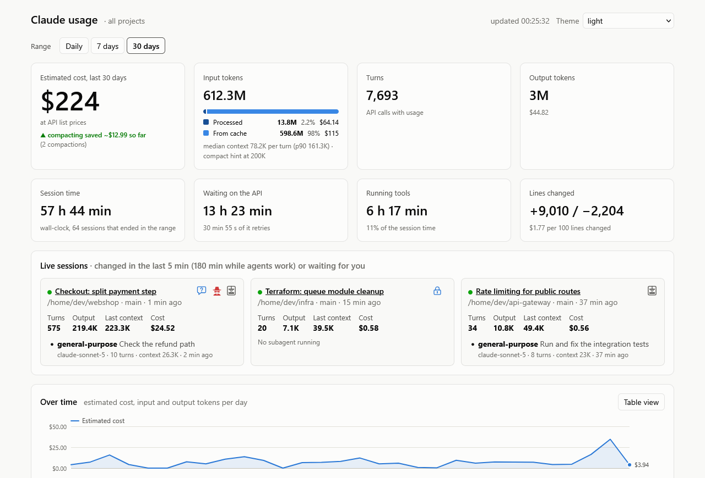

<div align="center">

# claude-usage

**See where your Claude Code tokens go, and keep the history after Claude Code deletes the transcripts.**

[](pyproject.toml)
[](#requirements)
[](docs/privacy.md)
[](LICENSE)

<picture>
  <source media="(prefers-color-scheme: dark)" srcset="docs/images/overview-dark.png">
  
</picture>

<sub>All screenshots show made-up demo data.</sub>

</div>

## Highlights

- 📚 **A history that outlives the transcripts.** Claude Code deletes its transcripts after 30 days. claude-usage
  keeps their token counts in a local SQLite store for 7, 30, 90 or 365 days, or for good, and each scan reads only
  what is new. → [Configuration and storage](docs/configuration.md)
- 💸 **Where every token and dollar went.** Cost and tokens by day or hour, by model and effort level (ultracode
  included), by agent type and by project, plus the background calls that no transcript shows. Each rate-limit window
  shows what it used before the limit hit. Open any session to see its subagents, its tools and its conversation.
  → [The dashboard](docs/dashboard.md)
- 🟢 **Live sessions that tell you when they need you.** A speech bubble when Claude asks you something, a padlock at
  a permission prompt, the agents still at work, and a desktop notification on Windows, WSL, macOS or Linux.
  → [Permission prompts and notifications](docs/notifications.md)
- 🗜️ **Knows when `/compact` pays off.** The context against the auto-compact point, the break-even learnt from your
  own past compactions, and a "Copy /compact" button when it is time. Afterwards it shows whether each compaction
  saved money or cost more. → [When compacting pays off](docs/compaction.md)
- 🕵️ **Flags possible secret access.** It lists every tool call that named `.env`, a key file, `~/.ssh` or a similar
  path, and how far each got: sent to a network program or an MCP server, returned into the conversation, or
  blocked. → [The session view](docs/session-view.md#possible-secret-access)

Standard library only · serves 127.0.0.1 only · never stores your prompts.

## TL;DR

Run it from a checkout, with nothing to install:

```bash
git clone https://github.com/SebastianKobs/claude-usage.git
cd claude-usage
make start        # prints the link: http://127.0.0.1:8765/?token=…
```

Open the link it prints. The first start reads every transcript, so it takes a moment. `make stop` stops the
dashboard.

Or install the `claude-usage` command:

```bash
pipx install .    # in the checkout; or pip install . inside a virtual environment
claude-usage serve
```

## Contents

- [Highlights](#highlights)
- [TL;DR](#tldr)
- [Good to know](#good-to-know)
  - [Requirements](#requirements)
  - [Everyday commands](#everyday-commands)
  - [The link carries a token](#the-link-carries-a-token)
  - [Your history is one file: back it up](#your-history-is-one-file-back-it-up)
  - [Keep more than 30 days](#keep-more-than-30-days)
  - [Scan without the dashboard](#scan-without-the-dashboard)
  - [See permission prompts](#see-permission-prompts)
  - [Costs are at API list prices](#costs-are-at-api-list-prices)
  - [Updating](#updating)
- [Further reading](#further-reading)
- [Development](#development)
- [License](#license)

## Good to know

### Requirements

- **Python 3.12 or newer.** Nothing else: no packages, no build step, no network access.
- **Linux, macOS or WSL.** On Windows itself the dashboard can't show permission prompts, which need a Unix socket.
- **`curl`**, only for the optional [permission hook](#see-permission-prompts).

The transcripts are read from `~/.claude/projects`, or from `$CLAUDE_CONFIG_DIR/projects` when that is set, as
Claude Code does.

### Everyday commands

| `make` target | Without make | What it does |
|---|---|---|
| `make start` | `claude-usage serve` | Starts the dashboard and prints its link. `make` runs it in the background (`PORT=`, `LIVE_MINUTES=`) |
| `make status`, `stop`, `restart`, `logs` | | Say whether it runs and where (`status` prints the link again), stop it, restart it, show its log |
| `make scan` | `claude-usage scan` | Reads new transcript data into the store (`--project PATH` for one project) |
| `make report ARGS="--days 7 --by project"` | `claude-usage report --days 7 --by project` | Prints totals as text. `--by` takes day, model, agent_type, project, skill, mcp_server or effort. `--json` prints JSON, `--no-scan` skips the scan |
| `make session ID=<session-id>` | `claude-usage report --session <id>` | Shows one session: main thread, subagents, background calls, tools |
| `make backup FILE=<new file>` | `claude-usage backup <new file>` | Writes a compacted copy of the store, and never overwrites a file |
| `make notify-test` | `claude-usage notify-test` | Shows one desktop notification and names the method |
| `make hook-line` | `claude-usage hook-settings` | Prints the permission hook's settings block |
| `make cron-line` | | Prints a crontab line that scans every 30 minutes |
| `make test`, `make help` | | Runs the tests; lists every target |

Without make, use `claude-usage` once it is installed, or `python3 -m claude_usage` in the checkout. `serve` runs in
the foreground and takes `--project PATH`. Every command takes `--store` and `--projects-dir`, and `--version`
prints the version.

### The link carries a token

The dashboard answers only a browser that holds the token of this start. The link it prints carries the token
(`http://127.0.0.1:8765/?token=…`). Opening it once puts the token into a cookie and removes it from the address bar.
Each start makes a new token, so **after a restart, open the new link**. `make status` prints it again.

### Your history is one file: back it up

| Running from | The store |
|---|---|
| a checkout | `data/usage.sqlite` |
| an installed copy | `~/.local/share/claude-usage/usage.sqlite` (`$XDG_DATA_HOME` is respected) |

> [!WARNING]
> In a checkout the store sits inside the working tree. `git clean -fdx` deletes it, and with it every day that
> Claude Code has already removed from its transcripts. Back it up outside the checkout now and then, or point
> `store` at a folder outside it.

```bash
make backup FILE=~/backups/usage-$(date +%F).sqlite
```

### Keep more than 30 days

By default the store keeps 30 days, as long as Claude Code keeps its transcripts. To keep your usage past their
cleanup, set `retention_days` to 90 or 365, or to 0 to keep everything:

```toml
# ~/.config/claude-usage/config.toml
retention_days = 365
```

After each scan, sessions whose last activity is older than that are deleted. Lowering the value deletes the older
sessions at the next scan. For every other setting, see [Configuration and storage](docs/configuration.md).

### Scan without the dashboard

The dashboard scans while it runs. To keep the history while it doesn't, scan from cron. `make cron-line` prints the
line for your checkout. It uses the interpreter's absolute path, because cron's `python3` may be older than 3.12:

```
*/30 * * * * cd '/path/to/claude-usage' && /usr/bin/python3 -m claude_usage scan >/dev/null
```

Errors go to stderr, so cron mails them. Give cron the same time zone as the dashboard: a scan files each call under
its local day.

### See permission prompts

No transcript records a permission prompt (the "Do you want to allow …?" dialog). To show one, the dashboard needs a
hook that Claude Code runs when the dialog opens. `make hook-line` prints the settings block:

- Put it into `~/.claude/settings.json` for every project, or into one project's `.claude/settings.local.json`, which
  git ignores, for that project only.
- If the file already has `"hooks"`, add the `"PermissionRequest"` entry to them.
- Claude Code reads hooks when a session starts. In a session that is already running, accept the hook in `/hooks`.

> [!CAUTION]
> Never put it into a project's `.claude/settings.json`. That file is committed, and everyone who works on the project
> would run the hook, whether they use claude-usage or not.

How the hook works and what it keeps: [Permission prompts and notifications](docs/notifications.md#the-permission-hook).

### Costs are at API list prices

Every amount is at the API's list prices, as if you paid per token. On a subscription they show where your limits go.
The prices ship with the package and are dated by `prices_checked`. An override in your config can change a single
price.

### Updating

```bash
make backup FILE=~/backups/usage-$(date +%F).sqlite   # optional; the store may hold days Claude Code deleted
git pull --recurse-submodules
make restart                                          # runs the new code, with a new link
```

The store updates itself, and no history is lost. For an installed copy, and for what a migration does, see
[Updating](docs/configuration.md#updating).

## Further reading

| Page | What it covers |
|---|---|
| [The dashboard](docs/dashboard.md) | Charts by model and effort, ultracode and background calls, rate-limit windows, the sessions list, paging, the live sessions and their icons |
| [The session view](docs/session-view.md) | The context gauge, the calls to compact or delegate, context per turn, possible secret access, tools, compactions, the conversation |
| [When compacting pays off](docs/compaction.md) | How the estimate works, a worked example, and what it can't know |
| [Permission prompts and notifications](docs/notifications.md) | The permission hook in detail, desktop notifications on each system, turning them off |
| [Configuration and storage](docs/configuration.md) | Every setting, where the files live, `CLAUDE_CONFIG_DIR`, retention, backups, updating |
| [Privacy and security](docs/privacy.md) | What is stored and what never is, the token, file modes, the warnings at start |

## Development

The project uses the standard library only and is developed test first. `make test` runs the tests (`python3 -m
unittest discover -s tests`). `make demo` serves the made-up data the screenshots show, on port 8799. The guard hook in `.claude/hooks/project-guard/` is a git submodule: clone with
`--recurse-submodules`, or run `git submodule update --init`. [CLAUDE.md](CLAUDE.md) holds the working rules, the
style, the transcript format and the design rules.

## License

[GPL-3.0](LICENSE)
