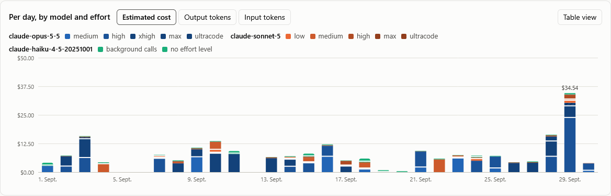
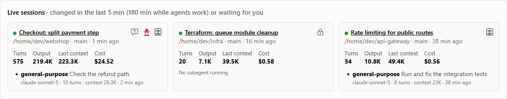

# The dashboard

[← Back to the README](../README.md)

The overview page answers what you used and where. It shows totals and charts by day, model, effort level, agent type
and project, the costliest sessions, the rate limits you hit, and the sessions running right now. Click any session to
open [its own view](session-view.md).

- [Ranges](#ranges)
- [Usage by model and effort](#usage-by-model-and-effort)
- [Rate limits](#rate-limits)
- [The sessions list](#the-sessions-list)
- [Tables and paging](#tables-and-paging)
- [Live sessions](#live-sessions)

## Ranges

The range buttons are Daily, 7 days, 30 days, 90 days and 1 year. Buttons past `retention_days` are hidden, since the
store holds nothing older. Daily shows one day by the hour, today by default, and the ‹ › arrows step to the earlier
days with usage. When a range starts before your history does, the page says "history since" that day.

## Usage by model and effort

Usage is split by model and effort level. Each model has its own color, and each higher effort level a darker shade
of it.

- **Ultracode** counts as a level of its own, `ultracode`, and is hatched in the chart. Claude Code notes ultracode
  only on your prompts, so a call counts as ultracode if it ran at xhigh between switching ultracode on and either
  switching it off or picking another effort level. Subagents and Workflow agents count by that time too.
- **Background calls** are Claude Code's own calls: Haiku for titles and classifiers, and web searches. They are in no
  transcript, only in the totals Claude Code writes when a process ends. They appear per model as "background calls",
  hatched the other way.

The metric switch shows the same chart as estimated cost, output tokens or input tokens. Every chart has a legend, a
table view and tooltips.

## Rate limits

Rate-limit hits are plotted per day. Each 5-hour window that hit a limit shows what it used from its start (5 hours
before its reset) up to the first hit, per model.

> [!NOTE]
> This is a lower bound on what a window holds: the limit also counts what you use elsewhere.

## The sessions list

The list holds every session of the range, newest first. To narrow it, pick a project, or type words from a title, a
project path or a session id.

The list and the Cost per session chart count what each session used in the range, so a session that ran over several
days splits across them. The session's own view shows all of it.

## Tables and paging

Tables longer than 10 rows, and more than 10 live sessions, come in pages of 10, 25 or 50 rows. The choice is
remembered and applies to every table. Previous and next sit by the table's heading, and a refresh stays on the page
you are reading.

## Live sessions

A session is live while its transcript changed in the last few minutes (`live_minutes`, 5 by default;
`make start LIVE_MINUTES=10` changes it). The live sessions follow the range: on an earlier day they are the running
sessions that were active on it.

Icons by each session's title show what it needs. Hover over one for the details.

| Icon | What it means | When it shows |
|---|---|---|
| Blue speech bubble with a question mark | Claude asked you something, a question or a plan to approve, and waits for your answer | Until you answer, however long that takes, unless the session went on without it |
| Blue padlock | A call waits for your permission | Only with the [permission hook](notifications.md#the-permission-hook). Without it, a permission prompt can't be told from a command still running, so nothing shows |
| Trash compactor | Compacting now would pay off, or the context is past your compact hint | In the colors of the [session view's estimate](session-view.md#the-context-gauge) |
| Agent in a black hat | A possible secret access | Where a call named a secret path and returned a result or sent it out; red where it was sent out. See [Possible secret access](session-view.md#possible-secret-access) |

A session you have open says the same under its heading, along with what the other live sessions wait for.

**Agents at work.** While a subagent or a workflow's agent is still at work (in a call, or before its next reply), its
session stays in the list for up to `agent_live_minutes` (180) after its last change. It stays even when a long
command leaves every transcript quiet. The card lists those agents.

The dashboard can also tell you through desktop notifications when a session starts waiting. See
[Permission prompts and notifications](notifications.md#desktop-notifications).
