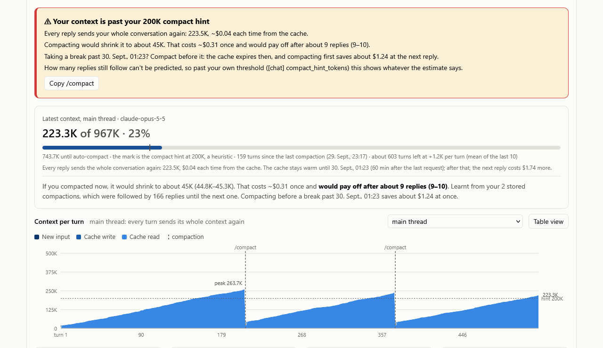
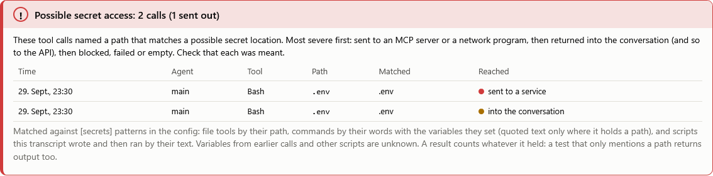

# The session view

[← Back to the README](../README.md)

Click a session to open it. Besides its cost, time and tables, it shows what its context holds, what compacting would
do, and which tool calls touched possible secrets. While the session runs, the view updates itself every few seconds,
the conversation too, without closing what you opened.

- [The context gauge](#the-context-gauge)
- [The call to compact](#the-call-to-compact)
- [The call to delegate exploration](#the-call-to-delegate-exploration)
- [Context per turn](#context-per-turn)
- [Subagents and workflow runs](#subagents-and-workflow-runs)
- [Possible secret access](#possible-secret-access)
- [Tools](#tools)
- [Compactions](#compactions)
- [The conversation](#the-conversation)

## The context gauge

The gauge shows the main thread's latest context against the auto-compact point. It marks your compact hint, counts
the turns since the last compaction, and estimates the turns left at the recent pace. Right after a compaction, until
the next reply, it shows the compaction and the context before it instead, with no call to compact.

Below it is what compacting now would cost: what each call re-reads, how long the cache stays warm, and what keeping
the context costs after that. From your stored compactions it also estimates after how many replies compacting would
pay off, marked by a color and said in words:

| Mark | Words | Meaning |
|---|---|---|
| Green | Soon | It pays off within half of the replies you usually still make |
| Yellow | Close | It pays off within the replies you usually still make |
| Grey | Not yet | The context is still too small; at its recent pace (right after a compaction, the pace before it), compacting would pay off in so many replies |
| Red | Likely too late | It pays off only after more replies than you usually make, or never |

How the estimate works: [When compacting pays off](compaction.md).

## The call to compact

While the session runs, a callout above the gauge says in plain words when to compact, with a button that copies
`/compact`. It shows in two cases:

- once the cache has expired and compacting saves at once;
- once the context has passed your compact hint (200K by default, `[chat] compact_hint_tokens`), whatever the
  estimate says, since how many replies still follow can't be predicted.

Replayed on stored sessions, compacting past the hint saved by far the most. Calling for it earlier, wherever
compacting likely paid, added next to nothing.

## The call to delegate exploration

A second callout suggests exploring in a subagent. It shows once the main thread has read and searched a lot since its
last compaction (20K tokens by default, `[chat] delegate_hint_tokens`) and your past sessions went on for many more
replies (60, `delegate_calls_ahead`). Every later reply re-reads what the main thread read, while a subagent hands back
only its summary.

## Context per turn

The chart stacks each turn's context as cache read, cache write and new input, with each `/compact` or auto-compact as
a rule. The picker switches between the main thread and its subagents. For the transcript picked, the tiles and tables
below show:

- the **fixed overhead**: the first call's context, which every later call reads again;
- the **cache rebuilds** and what they cost extra;
- the **compactions**;
- the **turns that grew the context most**, with the tools the call before them ran.

## Subagents and workflow runs

Each subagent's row shows what it returned to the main thread. A Workflow run's agents are grouped under one row per
run.

## Possible secret access

A warning under the tiles lists every tool call that named a possible secret location: `.env`, keys, `~/.ssh`,
`~/.aws` and so on, as set in `[secrets] patterns`. For each call it shows when, which agent and tool, the path, the
pattern it matched, and how far it got. It needs the transcript, so it disappears once Claude Code deletes it.

The most severe calls come first. The warning takes the look of its most severe row:

| Reached | Severity | Meaning | How the warning looks |
|---|---|---|---|
| sent to a service | high (red) | The call handed its input to an MCP server or a network program (`curl`, `ssh`, … as set in `[secrets] network_programs`) | Open, with a red edge and a "!" |
| into the conversation, or no result yet | medium (yellow) | A result came back and so went to the API with the next request, or may still. A sent call that failed counts here too: the service may have got it | Folded to one line, edged in yellow |
| into the conversation, likely a test | low-medium (blue dot) | The call looks like a test: a word, the script or the path matches `[secrets] test_patterns`, such as `tests`, `test_*` or `pytest`. It counts less | Folded to one line, as a plain card |
| error: blocked or failed, nothing returned | low | Nothing came back | Folded to one line, as a plain card |

- A command's own variables are expanded, so `D=~/.ssh; cat $D/id_rsa` counts.
- A script the session wrote and then ran is checked by its text.
- The files themselves are never read: only the paths the calls named.

## Tools

The Tools table lists the tools each transcript called, with errors, result and input sizes, and an estimate of what
the later calls paid to carry each call's input and result in their context. It splits them further:

- **Bash** by what a command does: search, view, edit in place, write a file, inline script, git, or run. This goes by
  the programs, in any language. Behind a button, each kind splits by program (git by subcommand), and each of those
  by the options it ran with, never its arguments or paths.
- **Read, Edit and Write** by file type, and by the options they gave, such as a line range.
- **Grep** by output mode, **Glob** by the file type it matches.
- **Agent** by subagent type, **Skill** by skill.
- **MCP tools** by server, then tool.

The table needs the transcript. Once it is gone, the stored totals per tool remain.

## Compactions

Each compaction is compared with keeping the context: what it cost once, what each later call saved, the call at
which it paid off, and whether it saved (green) or cost more (red). This is at API list prices, with the summary call
estimated. The table's heading adds them up.

The conversation shows the same at each compaction marker. The Estimated cost tile, here and on the overview, shows
what compacting saved so far. More in [When compacting pays off](compaction.md#afterwards).

## The conversation

On request, the conversation opens in its own frame right after the agents, while its transcript still exists (the
Tools table then moves to the end). Close puts it away again. It lists the newest first; the arrow switches to the
transcript's order (down: newest first, up: oldest first).

Along the way it hints at compacting:

- where the context passes 200K;
- more sternly where compacting now would pay for itself within the replies you usually make before the next
  compaction, going by your past compactions;
- most sternly near the auto-compact point.

The conversation is read from the transcript each time you open it, and never stored.
